### How to setup dev environment

1. Install NPM
2. Install visual studio code ( must )
3. install git and sign in ( either using vscode or GH CLI )

### Setup Project

1. Request collaboration access for https://github.com/bitzquad/bitzquad.com
2. `git clone https://github.com/bitzquad/bitzquad.com`
3. Go inside that folder and open it with VSCode
4. Open the terminal (CTRL + J )
5. Run `npm install`

### Run

1. Run `npm run dev`
2. Open the output url in browser. It will hot reload.

### How it works

We are using Next.JS static site generation.
Example : Create file `/pages/post/bitz.js` and it will generate `bitzquad.com/post/bitz`

They'll be statically generated HTML files which are SEO/Cache friendly.
Please read and understand about ReactJS + NextJS + NextJS static sites BEFORE doing any development in this repo.
Limitations : Client side React - OK ; Build-time static pages - OK ; Server prerendering - NOT OK

### Rules

1. First-time load network traffic for any page must be below 120 kB. !important
2. Always use Tailwind classes and @apply attributes for styling.
3. Never import more than 10 lines of CSS copied from other sites/themes.
4. Never use icon packs/external fonts. Use inline SVGs and CSS embeded SVGs instead.
5. Refractor into components when possible.
6. All images must be compressed into lossy JPGs. Use SVGs when possible.

Breaking these rules could lead into git commit reverts or bans 😮‍💨

### Contribute

We are following 'Scrum' git version control concepts for all our projects. Everyone must sync `main` branch but never commit directly. For every feature, one should create a branch from `main` and then pull commits from that branch to `main`. Use more sub branches like `dev` for complex features. All changes to `live` branch will update the production server or services.

1. Make sure your branch is `main` and sync with remote.

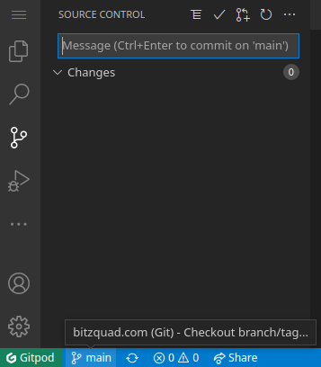

2. Create a new branch.

3. Use your name or the topic you are developing as the name. Example : `Rick` or `Chatbox`

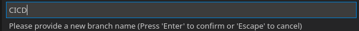

4. Code! Develop and test the app.

When you completed an atomic feature, git commit it. Always use a descriptive and formal commit message.

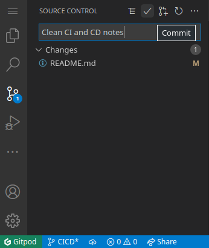

5. Publish your branch.

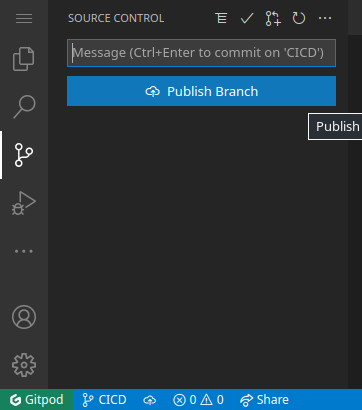

Repeatly commit into the same branch and sync until your feature is stable.

(Optional) When published, go to github.com and switch into your branch. If you see an orange color dot like this, it means that some of the checks aren't finished yet. If you have time, you can wait ~7 minutes until this checks are complete and a green color tick appears here. Click the tick and you'll get a tempory URL from cloudflare that hosts a live version of the site, with your code changes. This is completely optional.

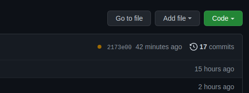

6. When commits are ready for publishing, Create a Pull Request.

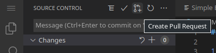

7. Make sure you are pulling 'from' your branch and pulling 'into' `main` or immediate upstream branch. Write a pull request title and description.

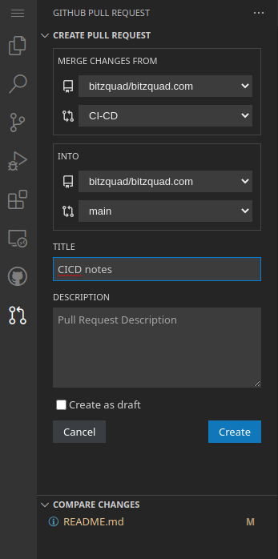

8. Wait until all checks are completed. Select `Squash and Merge` for small features with a few commits. Select `Create Merge Commit` for complex features with many commits.

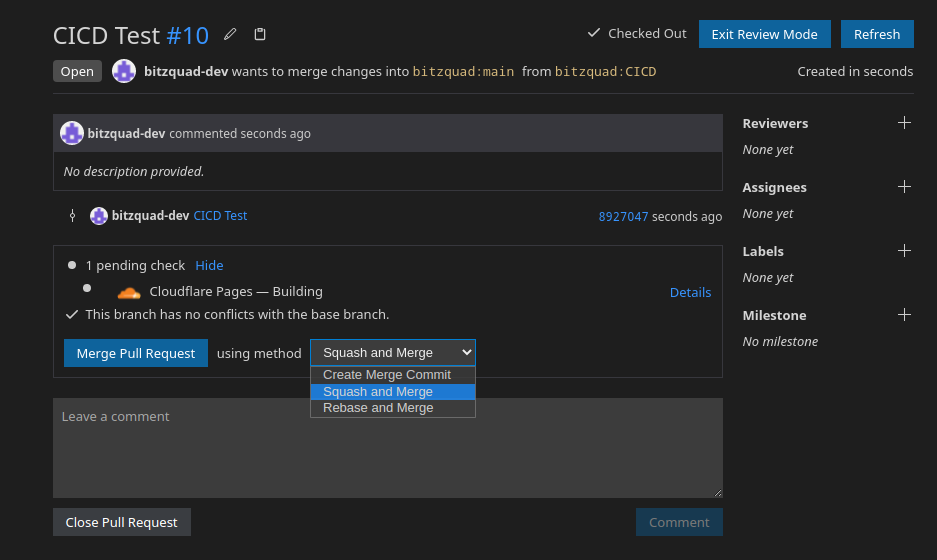

9. When checks are complete you'll get a 'Preview URL' from cloudflare. Open it and check if everything is working. Then, click `Merge Pull Request`. Otherwise, `Close Pull Request`.

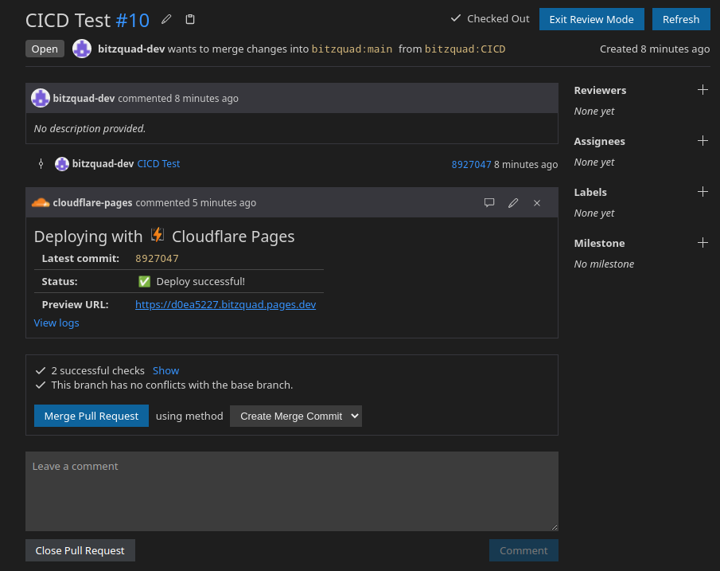

10. Create a Merge commit if asked.

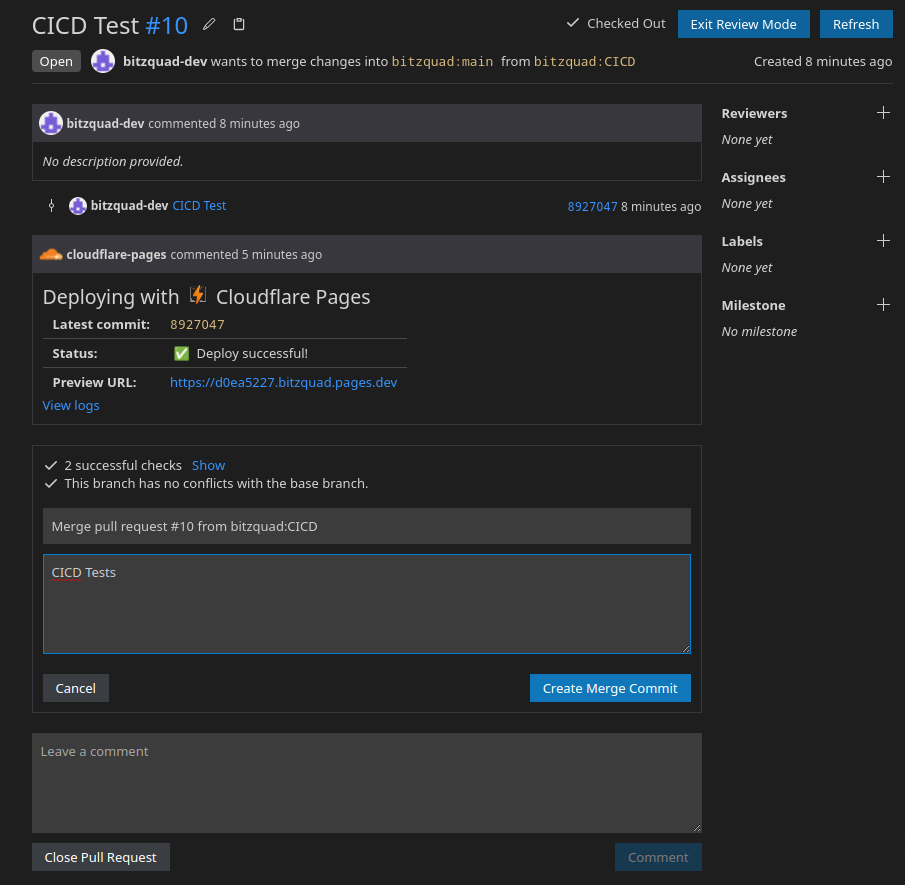

11. After checking out the pull request, `Delete branch`. Do this even if you are planning to do more development on the same topic.

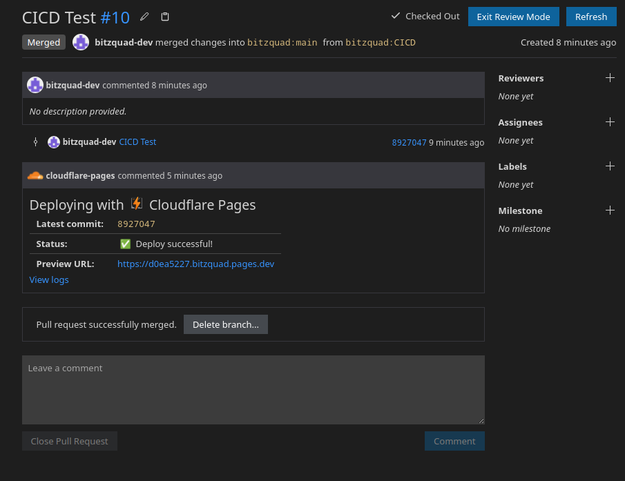

12. Delete both remote and local branches.

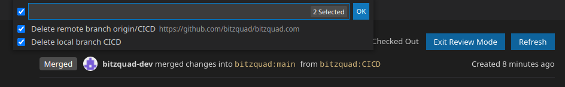

13. Make sure your current branch is `main` and sync. Start over from step 1 for your next feature.

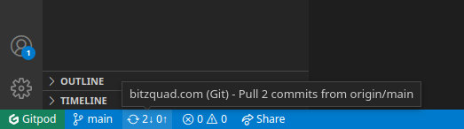

14. To update the production server, commits should be pulled into `live` branch. But, this should be done by the developer in charge of the production server. You can create a pull request from `main` to `live` and inform the developer via discord. **But DO NOT merge/checkout the pull request by yourself.** The developer in charge will review the changes, rebase `main` to `live` and then rebase `live` to `main` for synchronizing the branches.

#### Alternative case :

In step 8, if you face some 'unresolved conflicts' in the branch, like this :

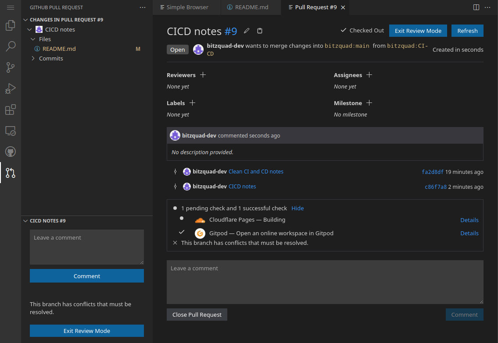

You should open the browser, go to https://github.com/bitzquad/bitzquad.com and open the pull request page. Click [Resolve Conflicts]

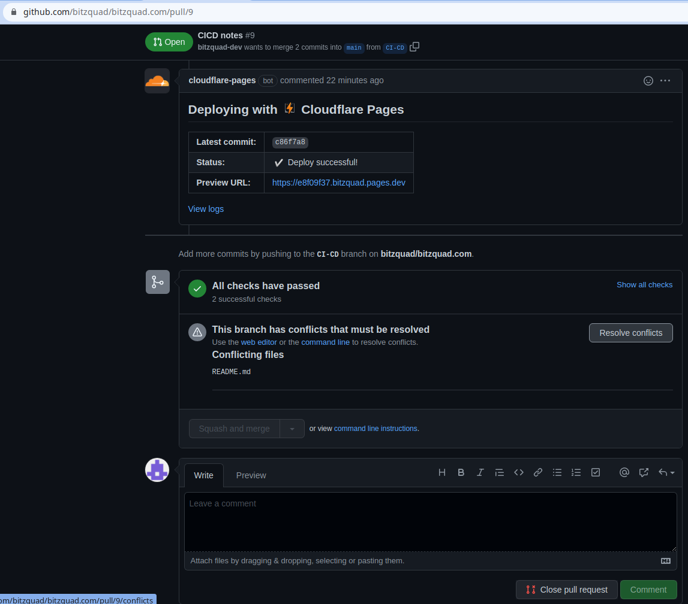

Resolve the code conflicts very carefully. If you have any doubts, do not resolve the conflicts. Contact the developer who wrote the conflicting commits for support.

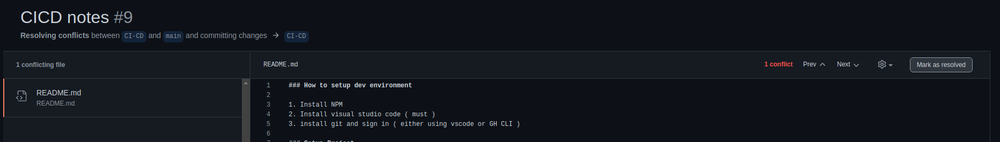
